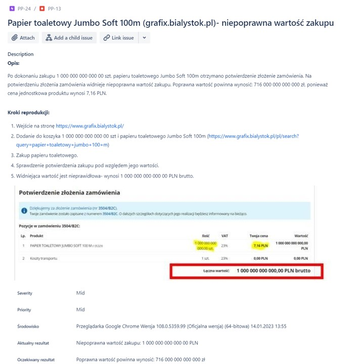
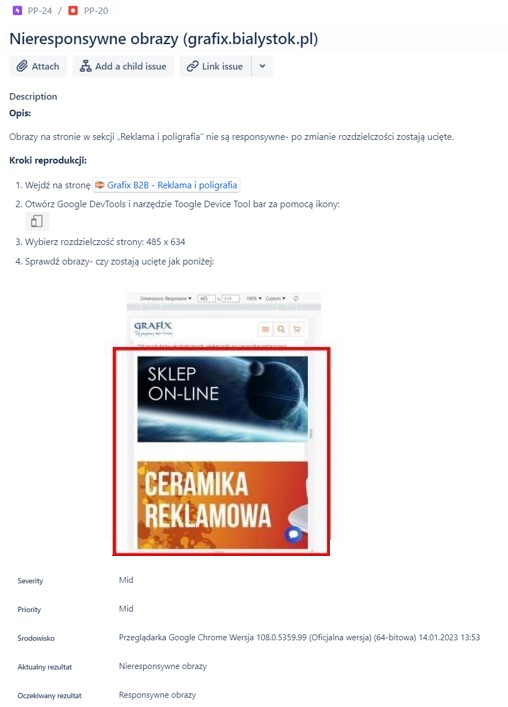
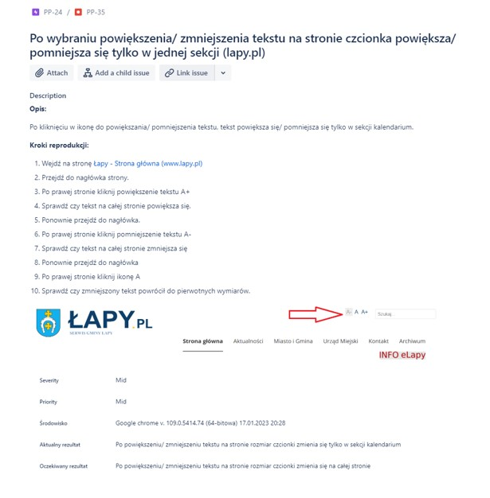
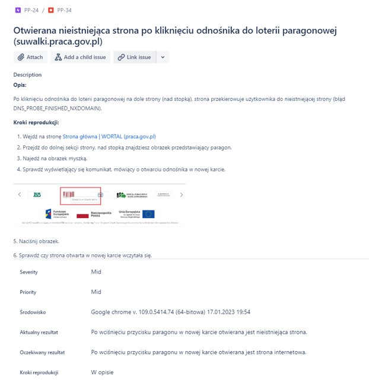
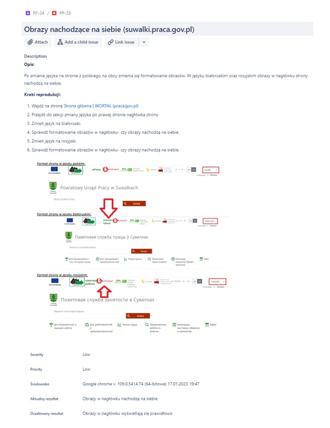
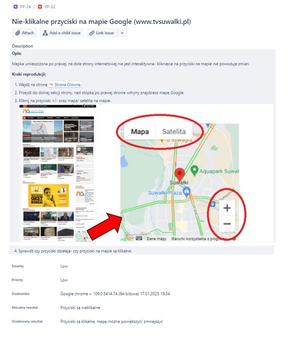
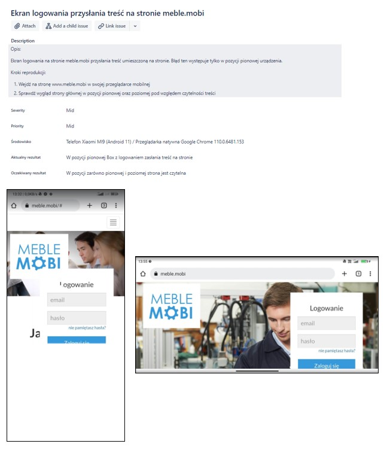
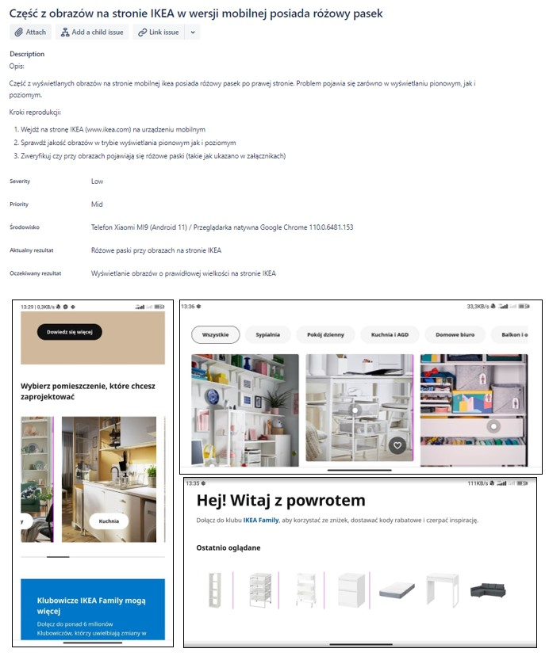
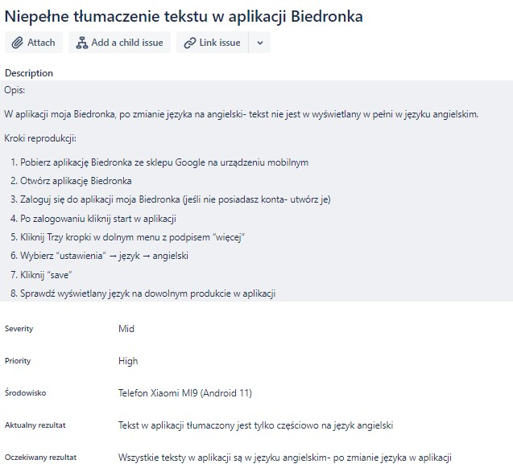

# BUG REPORTS

<ul>
<li>My accessibility bugs' reports found on web-pages you can find<a href= https://github.com/amiszkiel/BUG_REPORTS/blob/master/accesability%20testing-%20bugs%20reports.pdf><b> HERE </b></a>

<li>Some of my exercises of reporting (from JIRA) are below &#11015;&#65039;;
</ul>

<b>Reports were done in polish language.</b>

## Reports done by me:

### WEB PAGES:

<b> 1. An error on the website of an online store selling industrial products. </b>

type of testing: exploratory

<b> 2. (Potential issue) Page of an online store selling industrial products is not responsive. </b>

type of testing: exploratory

<b> 3. The increase in font size occurs only in one section of the page </b>

type of testing: exploratory + accessibility testing

<b> 4. Page not found- employment portal </b>

type of testing: exploratory

<b> 5. Overlapping images after changing language- employment portal  </b>

type of testing: exploratory

<b> 6. (Potential issue) Unclickable buttons-television page </b>

type of testing: exploratory

### MOBILE WEB PAGES:

<b> 1. The login screen obscures the content on the page </b>

<b> 2. Some of pictures have a pink stripe </b>

### MOBILE APP:

<b> 3. Incomplete translation of the text into English in the Biedronka application </b>

